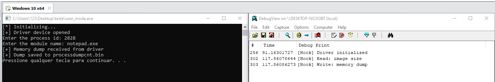

# Windows Kernel Memory Dump

*dump process modules from kernel*

## How it works

You send a process ID and module name (e.g. `notepad.exe`, `ntdll.dll`) to the driver via `DeviceIoControl`. The driver dumps the module's memory and returns it. The app saves to `processdumpcnt.bin` and fixes the PE headers.

## Demo

## Loading the driver

- **Option 1** — Test Mode (`sc create` / `sc start`)
- **Option 2** — [KDMapper](https://github.com/TheCruZ/kdmapper)

---

MAKE SURE TO ENABLE TEST MODE TO TEST THIS PROJECT. IF YOU WISH TO USE IT OUTSIDE TEST MODE, USE YOUR CUSTOM DRIVER LOADER OR SIGN THE DRIVER.

NOTE: THIS IS FOR EDUCATIONAL PURPOSES ONLY.

---
